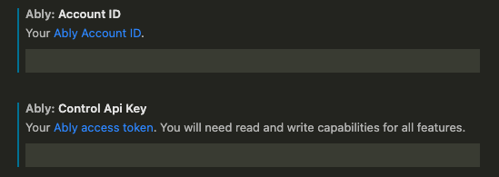
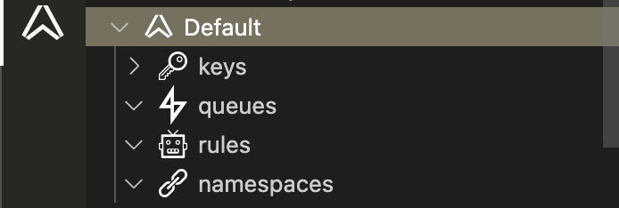
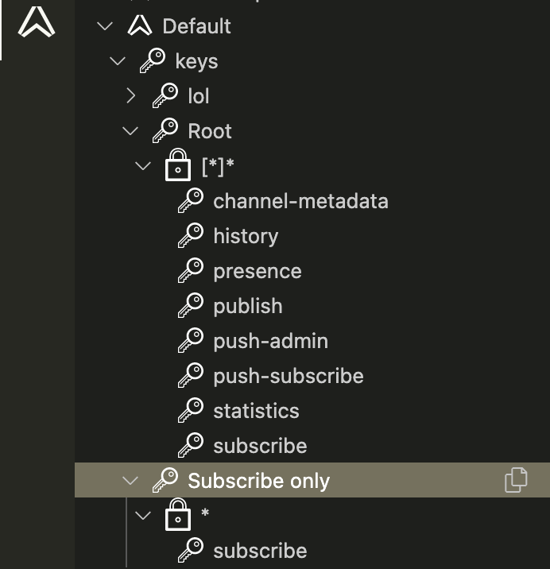

# Ably for Visual Studio Code

Use the Ably for VS Code extension to manage your Ably apps directly in VS Code.

The extension enables you to:

* List all apps in your Ably account
  * List the API keys, queues, rules and namespaces for each app
  * View API key capabilities and copy API keys to your clipboard
* Create an app

## Prerequisites

The only prerequisite is an [Ably account](https://ably.com/sign-up).

## Settings

Enter your Ably [account ID](https://ably.com/documentation/control-api#ids) and [access token](https://ably.com/documentation/control-api#authentication) in VS Code **Settings** to get started.

## List apps

Click on the Ably icon in the **Activity Bar** to view the apps in your Ably account. Apps will be listed in alphabetical order.

Expand an app to view the API keys, queues, rules and namespaces associated with it.

Expand the **keys** for an app to view its API keys. Expanding an API key displays the [capabilities](https://ably.com/documentation/core-features/authentication#capabilities-explained) associated with the key.

Use the copy to clipboard image to copy an API key.

## Create an app

1. Open the command palette (**CMD+SHIFT+P**) and choose `Ably: Create App`.
2. Enter a name for the app when prompted.
3. Select `enabled` for the app state.
4. Select whether to enforce TLS for connections or not.
5. A new app will be created and appear within your Ably dashboard and in the app list within VS Code.
