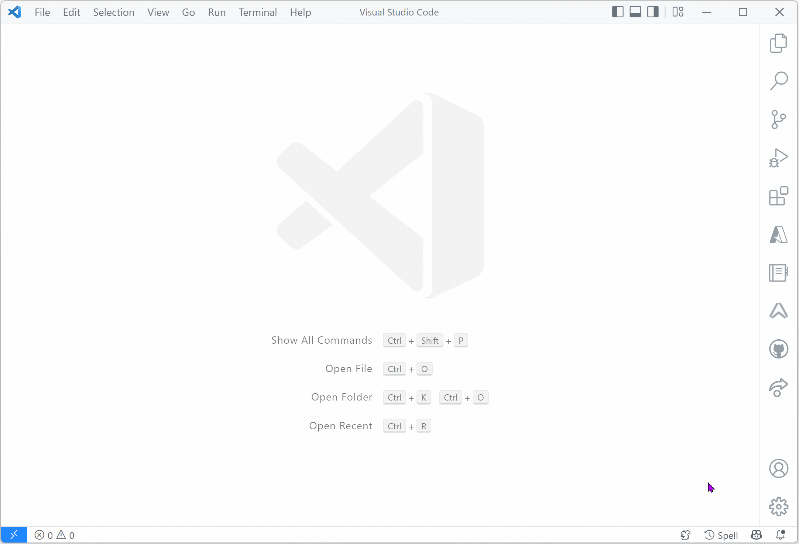

# Ably for Visual Studio Code

Use the *Ably for VS Code* extension to manage your Ably apps directly in VS Code.

The extension enables you to:

* List all apps in your Ably account.
  * View API keys, queues and integration rules for each app.
  * Copy API keys to your clipboard.
* Create an Ably app.

## Prerequisites

The only prerequisite is an [Ably account](https://ably.com/sign-up) which is free to sign-up.

## Installation

After installing this extension, you need to provide your Ably [account ID](https://ably.com/documentation/control-api#ids) and Control API [access token](https://ably.com/documentation/control-api#authentication) in VS Code **Settings** to get started.

## Features

### View Ably apps & details

Click on the Ably icon in the **Activity Bar** to view the apps in your Ably account. Apps will be listed in alphabetical order.

Expand an app to view the API keys, queues, rules and namespaces associated with it.

Use the *copy to clipboard* icon to copy an API key to the clipboard.

### Create an Ably app

1. Open the command palette (**CMD+SHIFT+P**) and choose `Ably: Create App`.
2. Enter a name for the app when prompted.
3. Select whether to enforce TLS for connections or not.
4. A new app will be created and appears in the list once the view has been automatically refreshed.

## Issues & Features

If you find an issue 🪲 or have a feature request 🚀 please [file them here](https://github.com/ably-labs/vscode-ably/issues/new/choose).

Note that this extension is still in preview.

## Contributing

Want to help contributing to this project? Have a look at our [contributing guide](CONTRIBUTING.md)!

## More info

- [Ably on Twitter](https://twitter.com/ablyrealtime)
- [Ably SDKs](https://github.com/ably/)
- [Ably.com](https://ably.com)

---

